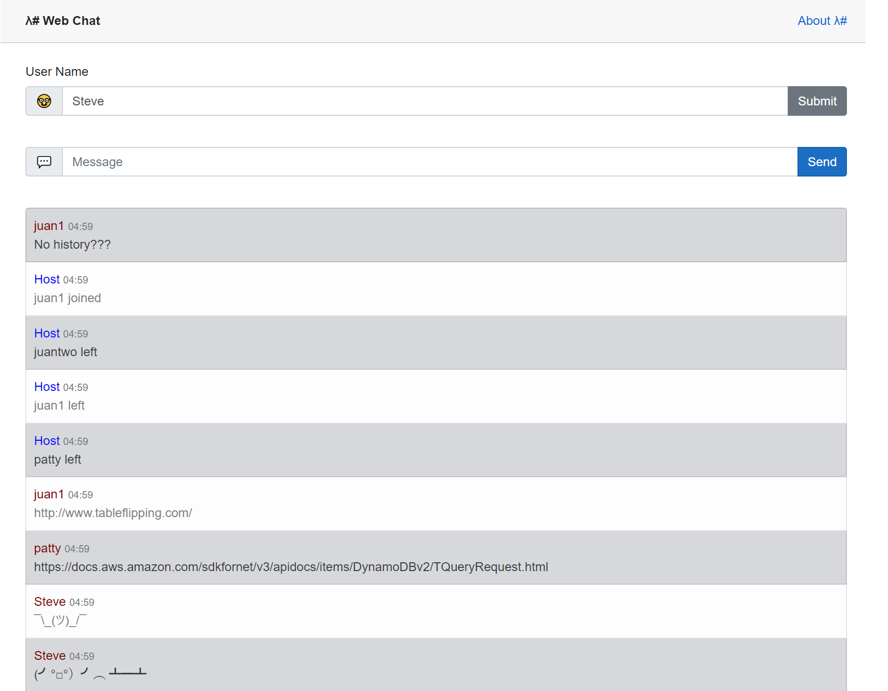

# LambdaSharp - Create a Web Chat with API Gateway WebSockets and ASP.NET Core Blazor WebAssembly

[This sample requires the LambdaSharp CLI to deploy.](https://lambdasharp.net/)

## Overview

This LambdaSharp module creates a web chat front-end using [ASP.NET Core Blazor WebAssembly](https://docs.microsoft.com/en-us/aspnet/core/blazor/get-started) and back-end using [API Gateway V2 WebSocket](https://aws.amazon.com/blogs/compute/announcing-websocket-apis-in-amazon-api-gateway/) as self-contained CloudFormation template. The front-end is served by an S3 bucket and secured by a CloudFront distribution. The front-end code is delivered as [WebAssembly](https://webassembly.org/) using ASP.NET Core Blazor. The back-end uses API Gateway V2 WebSocket to facilitate communication between clients. The code and assets for the front-end are built by `dotnet` and then copied to the S3 bucket during deployment. Afterwards, a CloudFront distribution is created to provide secure access over `https://` to the front-end. Finally, an API Gateway V2 WebSocket is deployed with two Lambda functions that handle WebSocket connections and message notifications.

> **NOTE:** This LambdaSharp module requires .NET Core 3.1.300 and LambdaSharp.Tool 0.8.0.2, or later.



## Deploy Module

This module is compiled to CloudFormation and deployed using the LambdaSharp CLI.
```
git clone https://github.com/LambdaSharp/WebSocketsChat-Sample.git
cd WebSocketsChat-Sample
lash deploy
```

## API Gateway .NET (WebSocket)

During the build phase, LambdaSharp extracts the message schema from the .NET implementation and uses it to configure the API Gateway V2 instance. If an incoming does not confirm to the expected schema of the web-socket route, then API Gateway will automatically reject it before it reaches the Lambda function.

```yaml
- Function: ChatFunction
  Description: Handle web-socket messages
  Memory: 256
  Timeout: 30
  Sources:

    - WebSocket: $connect
      Invoke: OpenConnectionAsync

    - WebSocket: $disconnect
      Inpvoke: CloseConnectionAsync

    - WebSocket: send
      Invoke: SendMessageAsync
```

Defining the JSON schema for the web-socket route doesn't require any special effort beyond some standard JSON annotations using the corresponding type.
```csharp
public abstract class AMessageRequest {

    //--- Properties ---
    public string Action { get; set; }
}

public class SendMessageRequest : AMessageRequest {

    //--- Properties ---
    public string Text { get; set; }
}

public async Task SendMessageAsync(SendMessageRequest request) {
  ...
}
```

## CloudFormation Details

The following happens when the module is deployed.

1. Create a DynamoDB table to track open connections.
1. Deploy the `ChatFunction` to handle web-socket requests.
1. Deploy `NotifyFunction` to broadcast messages to all open connections.
1. Create a private S3 bucket.
1. Create a bucket policy to CloudFront access.
1. Create a `config.json` file with the websocket URL.
1. Copy the `wwwroot` files to the S3 bucket using [brotli compression](https://en.wikipedia.org/wiki/Brotli).
1. Create CloudFront distribution to enable https:// access to the S3-hosted website
1. Create an SQS queue to buffer web-socket notifications.
1. Show the website URL.
1. Show the websocket URL.

> **NOTE:** Creating the CloudFront distribution takes up to 5 minutes. Granting permission to CloudFront to access the private S3 bucket can take up to an hour!

## Other Resources

The following site allows direct interactions with the WebSocket end-point using the WebSocket URL.

https://www.websocket.org/echo.html

This JSON message sends a _"Hello World!"_ notification to all participants:
```json
{
    "Action": "send",
    "Text": "Hello World!"
}
```

This JSON message changes the user name to _Bob_ for the current user:
```json
{
    "Action": "rename",
    "UserName": "Bob"
}
```

## DynamoDB Table

* `CreateUser(name)`
* `GetUser(user)`
* `GetSubscribedChannels(user)`
* `GetMessagesSince(channel, timestamp)`
* `GetUserConnections(user)`
* `GetChannelUsers(channel)`
* `GetChannel(channel)`
* `JoinChannel(user, channel)`
* `LeaveChannel(user, channel)`
* `CreateMessage(user, channel, text)`

Extra Credit
* `GetAllChannels()`
* `CreateChannel(name)`
* `DeleteChannel(channel)`

### Primary Records

**User Record**
  PK: "USER#${user-id}"
  SK: "INFO"
  UserId: string
  UserName: string

**Channel Record**
  PK: "ROOM#${room-id}"
  SK: "INFO"
  ChannelId: string
  ChannelName: string

**Connection Record* (TODO: this feel like it should be an index)**
  PK: "USER#${user-id}"
  SK: "WS#${connection-id}"
  ConnectionId: string

**Subscription Record**
  PK: "ROOM#${room-id}"
  SK: "USER#${user-id}"
  ChannelId: string
  UserId: string
  LastSeenTimestamp: timestamp

**Message Record**
  PK: "ROOM#${room-id}"
  SK: "WHEN#${timestamp}|{jitter}"
  UserId: string
  ChannelId: string
  When: number
  Message: string
  Jitter: string

### Projected Records

User-to-Channel (Subscription Record Index)
  PK: "USER#${user-id}"
  SK: "ROOM#${room-id}"
  ChannelId: string
  UserId: string
  LastSeenTimestamp: timestamp

Connection-to-User Index
  PK: "WS#${connection-id}"
  SK: "INFO"
  UserId: string

Global-Channels (Index)
  PK: "GLOBAL"
  SK: "ROOM#${room-id}"

Global-Users (Index)
  PK: "GLOBAL"
  SK: "USER#${user-id}"


## Future Improvements
- [x] Allow users to rename themselves.
- [x] Remember a user's name from a previous session using local storage.
- [x] Restrict access to S3 bucket to only allow CloudFront.
- [ ] Show previous messages when a user connects.
- [ ] Allow users to create or join chat rooms.
- [ ] Route API Gateway WebSocket requests via CloudFront.

## Acknowledgements

This LambdaSharp module is a port of the [netcore-simple-websockets-chat-app](https://github.com/normj/netcore-simple-websockets-chat-app) sample for AWS Lambda. For more information [Announcing WebSocket APIs in Amazon API Gateway](https://aws.amazon.com/blogs/compute/announcing-websocket-apis-in-amazon-api-gateway/) blog post.

Inspiration for the chat logic was taken from [Node.js & WebSocket — Simple chat tutorial](https://medium.com/@martin.sikora/node-js-websocket-simple-chat-tutorial-2def3a841b61).

## License

_Apache 2.0_ for the module and code.
